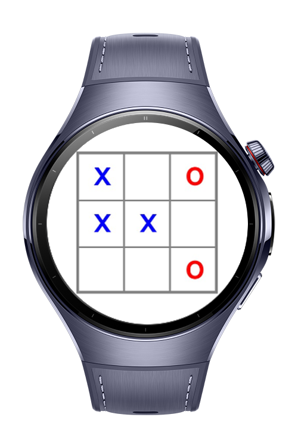
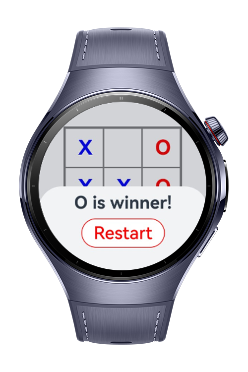
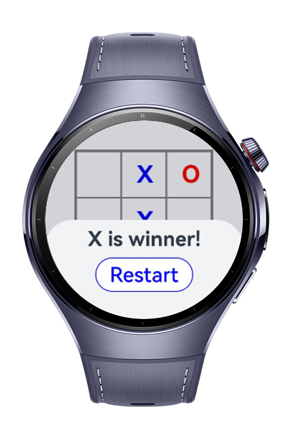

> **Note:** To access all shared projects, get information about environment setup, and view other guides, please visit [Explore-In-HMOS-Wearable Index](https://github.com/Explore-In-HMOS-Wearable/hmos-index).

# XoX Game
This is a basic XoX game that users can play using Huawei watches

# Preview
<div>



</div>

# Use Cases
- User can play as X player or O player
- One of them can win or game can finish in a draw

# Tech Stack

- **Languages**: ArkTS, ArkUI
- **Frameworks**: HarmonyOS SDK 5.0.2(14)
- **Tools**: DevEco Studio Vers 5.1.0.820
- **Libraries**: @kit.ArkUI

# Directory Structure
```
entry/src/main/ets/
|---pages
|   |---Index.ets                
|---components      
|   |---GameBox.ets                       
|---model   
|   |---Box.ets                           
|---entryability                   
|---entrybackupability   
|---Utils.ets   
```

# Constraints and Restrictions
## Supported Device
- Huawei watch 5

# LICENSE
**XoX Game** is distributed under the terms of the MIT License.
See the [LICENSE](/LICENSE) for more information.